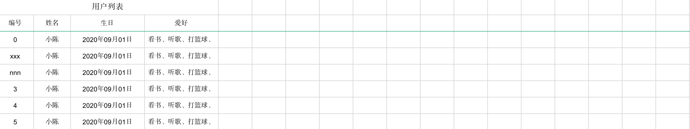

# EasyPOI实战教程

## 简介

easypoi功能如同名字easy,主打的功能就是容易,让一个没见接触过poi的人员 就可以方便的写出Excel导出,Excel模板导出,Excel导入,Word模板导出,通过简单的注解和模板 语言(熟悉的表达式语法),完成以前复杂的写法

## 使用EasyPOI

### 环境搭建

```markdown
# 1.引入相关依赖
```

```xml
<dependency>
  <groupId>cn.afterturn</groupId>
  <artifactId>easypoi-base</artifactId>
  <version>3.2.0</version>
</dependency>

<dependency>
  <groupId>cn.afterturn</groupId>
  <artifactId>easypoi-web</artifactId>
  <version>3.2.0</version>
</dependency>

<dependency>
  <groupId>cn.afterturn</groupId>
  <artifactId>easypoi-annotation</artifactId>
  <version>3.2.0</version>
</dependency>
```


### 相关注解

```markdown
# 1.注解说明
- easypoi起因就是Excel的导入导出,最初的模板是实体和Excel的对应,model--row,filed--col 这样利用注解我们可以和容易做到excel到导入导出经过一段时间发展,现在注解有5个类分别是
```

- **@Excel** 作用到filed上面,是对Excel一列的一个描述
- **@ExcelCollection** 表示一个集合,主要针对一对多的导出,比如一个老师对应多个科目,科目就可以用集合表示
- **@ExcelEntity** 表示一个继续深入导出的实体,但他没有太多的实际意义,只是告诉系统这个对象里面同样有导出的字段
- **@ExcelIgnore** 和名字一样表示这个字段被忽略跳过这个导导出
- **@ExcelTarget** 这个是作用于最外层的对象,描述这个对象的id,以便支持一个对象可以针对不同导出做出不同处理

#### @ExcelTarget

```markdown
# 1.说明
- 用在实体类上标识是一个可以通过EasyPOI导入导出的实体类
- 相关属性:
	value:  		[String][定义id唯一标识,不能重复]    `常用`
	height: 		[Double][定义单元格高度]
	fontSize:		[short ][定义单元格字体大小]

# 2.使用
```

```java
@ExcelTarget("users")
public class User implements Serializable {
 	//..... 省略属性 相关GET,SET方法
}
```


---

#### @Excel

```markdown
# 1.说明
- 用在filed(属性)上面,是对Excel一列的一个描述
- 常用属性: 
	name		 : 			 [String][生成Excel表格中列名]
	needMerge:			 [boolean][是否需要纵向合并单元格(用于含有list中,单个的单元格,合并list创建的多个row)]
	orderNum :       [String][指定生成Excel中列的顺序,按照数字自然顺序排序]
	savePath :       [String][指定导入Excel中图片的保存路径]
	type		 :       [String][导出类型 1 是文本 2 是图片,3 是函数,10 是数字 默认是文本]
	width    :			 [Double][指定导出Excel时列的宽度]
	isImportField:   [boolean][是否是导入字段,如果没有说明是错误的Excel]
	exportFormat:    [String][导出Excel的时间格式]
	importFormat:    [String][导入Excel的时间格式]
	format	 :       [String][相当于同时设置了exportFormat和importFormat]
	imageType:  		 [int   ][导出类型 1 从file读取 2 是从数据库中读取 默认是文件 同样导入也是一样的]
	suffix	 :       [String][文字后缀,如% 90 变成90%]
```

```java
public class User implements Serializable {

    @Excel(name="编号",orderNum="1",replace = {"xxx_1","nnn_2"})
    private String id;
    
    @Excel(name="姓名",orderNum="2")
    private String name;

    @Excel(name="年龄",orderNum="4",suffix = " $")
    private Integer age;

    @Excel(name="生日",orderNum = "3",width = 20.0,exportFormat = "yyyy年MM月dd日")
    private Date bir;
  	//...省略GET、SET方法
}
```


---

#### @ExcelEntity

```markdown
# 1.说明
- 标记是不是导出excel 标记为实体类,一遍是一个内部属性类,标记是否继续穿透
- 常用属性:
	name: [String][定义唯一标识]
```

```java
@ExcelTarget("users")
public class User implements Serializable {
		//... 省略GET SET和其他属性
    @ExcelEntity(name="身份信息")
    private Card card;
}

@ExcelTarget("card")
public class Card  implements Serializable {
    @Excel(name="身份证号",orderNum = "6")
    private String id;
    @Excel(name="家庭住址",orderNum = "7")
    private String address;
}
```


----

#### @ExcelCollection

```markdown
# 1.说明
- 一对多的集合注解,用以标记集合是否被数据以及集合的整体排序
- 常用属性:
	name		: 		[String][定义集合列名]
	orderNum:			[int][用来指定导出excel集合内列的顺序]
	type		:     [Class\<?>][用来指定导出是创建对象类型]
```

```java
@ExcelTarget("users")
public class User implements Serializable {    
  	//....省略GET SET其他属性
		@ExcelCollection(name="订单",orderNum = "5")
    private List<Order> orders;
}

@ExcelTarget("orders")
public class Order implements Serializable {
		//....省略GET SET方法
    @Excel(name = "订单编号")
    private String id;
    @Excel(name = "订单名称")
    private String name;
}
```


----

#### @ExcelIgnore

```markdown
# 1.说明
- 用在属性上，导出Excel时忽略这个属性
```

---

## 导出Excel

#### 1.导出基本数据

> `注意:导出Excel的对象必须实现对象序列化接口`

```markdown
# 1.定义对象
```

```java
@ExcelTarget("users")
public class User implements Serializable {
    @Excel(name="编号",orderNum="1",replace = {"xxx_1","nnn_2"})
    private String id;
    @Excel(name="姓名",orderNum="2")
    private String name;
    @Excel(name="年龄",orderNum="4",suffix = " $")
    private Integer age;
    @Excel(name="生日",orderNum = "3",width = 20.0,exportFormat = "yyyy年MM月dd日")
    private Date bir;
    //省略GET、SET方法。。。
}
```

```markdown
# 2.定义测试数据
```

```java
//测试数据 
public static List<User> getUsers(){
  List<User> users = new ArrayList<>();
  for (int i = 0; i < 10; i++) {
    User user = new User();
    user.setId(String.valueOf(i));
    user.setName("小陈");
    user.setAge(20+i);
    user.setBir(new Date());
    users.add(user);
  }
  return users;
}
```

```markdown
# 3.导出Excel
```

```java
Workbook workbook = ExcelExportUtil.exportExcel(new ExportParams("用户列表","测试"),User.class,getUsers());
FileOutputStream outputStream = new FileOutputStream("/Users/chenyannan/Desktop/aa.xls");
workbook.write(outputStream);
outputStream.close();
workbook.close();
```

```markdown
# 4.查看Excel
```


---

#### 2.导出指定字段

```java
//@Excel(name="年龄",orderNum="4",suffix = " $")
@ExcelIgnore
private Integer age;
```


#### 3.导出list集合

```markdown
# 1.说明
- 往往有时候导出的对象中含有数组或者集合,需要导出这样的数据可以直接使用@Excel进行导出
```

```java
@ExcelTarget("users")
public class User implements Serializable {
  @Excel(name="爱好",orderNum = "5",width = 20.0)
	private List<String> habbys;
  //....
}
```


```markdown
# 2.说明
- 从上面运行结果可以看出,导出的格式默认是上述图片中格式,如果需要自定义导出格式怎么办?
- 自定义导出格式可以在对应的set方法中进行处理即可
```

```java
@ExcelTarget("users")
public class User implements Serializable {
		@ExcelIgnore  //忽略原始list集合
    private List<String> habbys;

    @Excel(name="爱好",orderNum = "5",width = 20.0)
    private String habbysstr; //定义一个list集合字符串,用来存储集合数据

    public String getHabbysstr(){ //修改get方法
        StringBuilder sb = new StringBuilder();
        this.habbys.forEach(s->sb.append(s).append("、"));
        return sb.toString();
    }
}
```


```markdown
# 3.导出查看结果
```



----

#### 3.导出对象中含有对象

```markdown
# 1.说明
- 导出对象中含有对象的Excel
```

```java
@ExcelTarget("users")
public class User implements Serializable {

    @ExcelEntity(name="card") //定义对象
    private Card card;
		//.....
}

@ExcelTarget("card")
public class Card  implements Serializable {
    @Excel(name="身份证号",orderNum = "6")
    private String id;
    @Excel(name="家庭住址",orderNum = "7")
    private String address;
}
```

```markdown
# 2.为导出对象赋值
```

```java
//测试数据
public static List<User> getUsers(){
  List<User> users = new ArrayList<>();
  for (int i = 0; i < 10; i++) {
    User user = new User();
    user.setId(String.valueOf(i));
    user.setName("小陈");
    user.setAge(20+i);
    user.setBir(new Date());
    user.setHabbys(Arrays.asList("看书","听歌","打篮球"));
    user.setCard(new Card("11000103422323212342","北京市朝阳区"));
    users.add(user);
  }
  return users;
}
```

```markdown
# 3.导出Excel
```

```java
Workbook workbook = ExcelExportUtil.exportExcel(new ExportParams("用户列表","测试"),User.class,getUsers());
FileOutputStream outputStream = new FileOutputStream("/Users/chenyannan/Desktop/aa.xls");
workbook.write(outputStream);
outputStream.close();
workbook.close();
```


----

#### 4.导出一对多关系

```markdown
# 1.说明
- 往往在业务比较复杂时,我们需要导出一对多关联关系处理,如 导出学生课程信息,导出用户的所有订单信息等等....
- 在Easypoi中如何处理一对多关系呢? 
```

```java
@ExcelTarget("users")
public class User implements Serializable {
		//......
    @ExcelCollection(name="订单信息",orderNum="8")
    private List<Order> orders; //定义集合
}
```

```java
@ExcelTarget("orders")
public class Order implements Serializable {
    @Excel(name = "订单编号")
    private String id;   
    @Excel(name = "订单名称")
    private String name;
}
```

```markdown
# 2.测试数据
```

```java
 //测试数据
public static List<User> getUsers(){
  List<User> users = new ArrayList<>();
  for (int i = 0; i < 10; i++) {
    User user = new User();
    user.setId(String.valueOf(i));
    user.setName("小陈");
    user.setAge(20+i);
    user.setBir(new Date());
    user.setHabbys(Arrays.asList("看书","听歌","打篮球"));
    user.setCard(new Card("11000103422323212342","北京市朝阳区"));
    user.setOrders(Arrays.asList(new Order("1","超短裙"), new Order("2","iphone X")));
    users.add(user);
  }
  return users;
}
```

```markdown
# 3.导出Excel
```

```java
Workbook workbook = ExcelExportUtil.exportExcel(new ExportParams("用户列表","测试"),User.class,getUsers());
FileOutputStream outputStream = new FileOutputStream("/Users/chenyannan/Desktop/aa.xls");
workbook.write(outputStream);
outputStream.close();
workbook.close();
```


---

#### 5.导出图片

```markdown
# 1.说明
- 往往随着业务不断变化,可能需要在导出excel时将图片信息也一并导出,如商品图标,用户头像信息等数据,这个时候easypoi该如何处理呢?
```

```java
@ExcelTarget("users")
public class User implements Serializable {
		//.....
    @Excel(name="头像信息",type = 2,orderNum = "0",width = 12,height = 12)//type的值一定要指定为2
    private String photo;//定义头像 直接写指定图片路径
}
```

```markdown
# 2.准备图片放入指定路径中,并在测试数据中进行赋值
```

```java
//测试数据
public static List<User> getUsers(){
  List<User> users = new ArrayList<>();
  for (int i = 0; i < 10; i++) {
    User user = new User();
    user.setId(String.valueOf(i));
    user.setName("小陈");
    user.setAge(20+i);
    user.setBir(new Date());
    user.setHabbys(Arrays.asList("看书","听歌","打篮球")); //设置爱好
    user.setCard(new Card("11000103422323212342","北京市朝阳区"));//设置对象
    user.setOrders(Arrays.asList(new Order("1","超短裙"), new Order("2","iphone X")));//设置集合
    user.setPhoto("/Users/chenyannan/Desktop/1.jpeg");//设置头像
    users.add(user);
  }
  return users;
}
```


```markdown
# 3.导出Excel查看结果
```


---

#### 6.大数据量导出

```markdown
# 1.说明
- 大数据导出是当我们的导出数量在几万,到上百万的数据时,一次从数据库查询这么多数据加载到内存然后写入会对我们的内存和CPU都产生压力,这个时候需要我们像分页一样处理导出分段写入Excel缓解Excel的压力
```

```java
Workbook workbook1 = ExcelExportUtil.exportBigExcel(new ExportParams("用户列表", "测试"), User.class, getUsers());
workbook1.write(outputStream);
ExcelExportUtil.closeExportBigExcel();
```

> `注意:最好大量数据进行分页处理,每次导出数据最好不要超过1W条记录`

---

## 导入Excel

#### 1.导入基本数据

```markdown
# 0.准备导入的目标Excel
```


```markdown
# 1.定义导出数据基本对象
- 为了节省篇幅,一下代码统一忽略getter,setter
```

```java
public class Student  implements Serializable {
    @Excel(name="编号")
    private String id;
    @Excel(name="姓名")
    private String name;
    @Excel(name="年龄")
    private Integer age;
    @Excel(name="生日",format = "yyyy年MM月dd日")
    private Date bir;
}
```

```markdown
# 2.导入excel中数据
```

```java
@Test
public void test(){
  //定义导入参数
  ImportParams importParams = new ImportParams();
  importParams.setTitleRows(1);
  importParams.setHeadRows(1);
  //导出数据 餐数1:当如excel文件  参数2:导入对象的类型 参数3:导入参数配置
  List<Student> students = ExcelImportUtil.importExcel(new File("/Users/chenyannan/Desktop/student.xls"), Student.class,importParams);
  students.forEach(s-> System.out.println(s));
}
```

```markdown
# 3.查看导入结果
```


----

#### 2.导入小技巧

```markdown
# 1.技巧说明
- 读取指定的sheet
	比如要读取上传得第二个sheet 那么需要把startSheetIndex = 1 就可以了

- 读取几个sheet 
	比如读取前2个sheet,那么 sheetNum=2 就可以了

- 读取第二个到第五个sheet
	设置 startSheetIndex = 1 然后sheetNum = 4

- 读取全部的sheet
	sheetNum  设置大点就可以了
	
- 判断一个Excel是不是合法的Excel 
	importFields 设置下值,就是表示表头必须至少包含的字段,如果缺一个就是不合法的excel,不导入
```

#### 3.带图片导入

```markdown
# 0.准备数据
```


```markdown
# 1.说明
- 有图片的导出就有图片的导入,导入的配置和导出是一样的,但是需要设置保存路径
```

```java
public class Student  implements Serializable {

    @Excel(name="编号")
    private String id;
    @Excel(name="姓名")
    private String name;
    @Excel(name="年龄")
    private Integer age;
    @Excel(name="生日",format = "yyyy年MM月dd日")
    private Date bir;
    @Excel(name="头像信息",type = 2,savePath = "/Users/chenyannan/IdeaProjects/180codes/baizhimail/src/main/webapp")
    private String photo;
}

```


```markdown
# 2.导入Excel
```

```java
@Test
public void test(){
  //定义导入参数
  ImportParams importParams = new ImportParams();
  importParams.setTitleRows(1);
  importParams.setHeadRows(1);
  importParams.setImportFields(new String[]{"生日"});

  importParams.setNeedSave(false);//是否保存上传的excel
  importParams.setSaveUrl("/Users/chenyannan/IdeaProjects/180codes/baizhimail/src/main/webapp");

  //导出数据 餐数1:当如excel文件  参数2:导入对象的类型 参数3:导入参数配置
  List<Student> students = ExcelImportUtil.importExcel(new File("/Users/chenyannan/Desktop/students.xls"), Student.class,importParams);
  students.forEach(s-> System.out.println(s));
}
```


```markdown
# 3.测试导入结果
```


---

## 集成web实现导入导出

#### 1.搭建springboot+mybatis项目环境

```markdown
# 1.创建springboot项目
```


```markdown
# 2.引入相关依赖
- mybatis
- mysql
- druid
- easypoi
- 引入thymelaf
```

```xml
<!--引入mybatis-->
<dependency>
  <groupId>org.mybatis.spring.boot</groupId>
  <artifactId>mybatis-spring-boot-starter</artifactId>
  <version>2.1.3</version>
</dependency>
<!--引入mysql-->
<dependency>
  <groupId>mysql</groupId>
  <artifactId>mysql-connector-java</artifactId>
  <version>5.1.38</version>
</dependency>
<!--引入druid-->
<dependency>
  <groupId>com.alibaba</groupId>
  <artifactId>druid</artifactId>
  <version>1.1.19</version>
</dependency>
<!--引入thymelaf-->
<dependency>
  <groupId>org.springframework.boot</groupId>
  <artifactId>spring-boot-starter-thymeleaf</artifactId>
</dependency>
<!--引入easypoi-->
<dependency>
  <groupId>cn.afterturn</groupId>
  <artifactId>easypoi-base</artifactId>
  <version>3.2.0</version>
</dependency>
<dependency>
  <groupId>cn.afterturn</groupId>
  <artifactId>easypoi-web</artifactId>
  <version>3.2.0</version>
</dependency>
<dependency>
  <groupId>cn.afterturn</groupId>
  <artifactId>easypoi-annotation</artifactId>
  <version>3.2.0</version>
</dependency>
```

```markdown
# 3.编写配置文件
```

```properties
server.port=8989
spring.application.name=easypoi

spring.thymeleaf.cache=false

spring.datasource.type=com.alibaba.druid.pool.DruidDataSource
spring.datasource.driver-class-name=com.mysql.jdbc.Driver
spring.datasource.url=jdbc:mysql://localhost:3306/easypoi?characterEncoding=UTF-8
spring.datasource.username=root
spring.datasource.password=root

mybatis.mapper-locations=classpath:com/baizhi/mapper/*.xml
mybatis.type-aliases-package=com.baizhi.entity
```

```markdown
# 4.创建包结构
```


```markdown
# 5.启动项目检测环境搭建是否成功
```


---

#### 2.开发测试页面

```html
<!DOCTYPE html>
<html lang="en">
<head>
    <meta charset="UTF-8">
    <title>导入excel的主页面</title>
    <link rel="stylesheet" href="https://cdn.jsdelivr.net/npm/bootstrap@3.3.7/dist/css/bootstrap.min.css" integrity="sha384-BVYiiSIFeK1dGmJRAkycuHAHRg32OmUcww7on3RYdg4Va+PmSTsz/K68vbdEjh4u" crossorigin="anonymous">
</head>
<body>
    <div class="container-fluid">
        <div class="row">
            <div class="col-md-12">
                <h1>选择Excel文件导入到数据中</h1>
                <form action="" method="post" class="form-inline">
                    <div class="form-group">
                        <input class="form-control" type="file" name="excelFile">
                        <input type="submit" class="btn btn-danger" value="导入数据">
                    </div>
                </form>
            </div>
            <div class="col-md-12">
                <h1>显示导入数据列表</h1>
                <table class="table table-bordered" >
                    <tr>
                        <th>编号</th>
                        <th>头像</th>
                        <th>姓名</th>
                        <th>年龄</th>
                        <th>生日</th>
                    </tr>
                    <tr>
                        <td>1</td>
                        <td></td>
                        <td>小陈</td>
                        <td>23</td>
                        <td>2012-12-12</td>
                    </tr>
                    <tr>
                        <td>1</td>
                        <td></td>
                        <td>小陈</td>
                        <td>23</td>
                        <td>2012-12-12</td>
                    </tr>
                </table>

                <hr>
                <input type="button" class="btn btn-info" value="导出excel">

            </div>

        </div>
    </div>
</body>
</html>
```


---

#### 3.查询所有

```markdown
# 0.准备数据Excel
```


```markdown
# 1.根据Excel抽取库表结构
```

```sql
SET NAMES utf8mb4;
SET FOREIGN_KEY_CHECKS = 0;

-- ----------------------------
-- Table structure for t_user
-- ----------------------------
DROP TABLE IF EXISTS `t_user`;
CREATE TABLE `t_user` (
  `id` int(6) NOT NULL AUTO_INCREMENT,
  `name` varchar(255) DEFAULT NULL,
  `bir` timestamp NULL DEFAULT NULL,
  `photo` varchar(150) DEFAULT NULL,
  `habbys` varchar(100) DEFAULT NULL,
  `cardno` varchar(18) DEFAULT NULL,
  `address` varchar(60) DEFAULT NULL,
  PRIMARY KEY (`id`)
) ENGINE=InnoDB DEFAULT CHARSET=utf8;

SET FOREIGN_KEY_CHECKS = 1;
```

```markdown
# 2.创建实体类
```

```java
@Data
@ExcelTarget("users")
public class User implements Serializable {
    @Excel(name="编号")
    private String id;
    @Excel(name="姓名")
    private String name;
    @Excel(name="生日",format = "yyyy年MM月dd日")
    private Date bir;
    @Excel(name="头像信息",type = 2,savePath = "/Users/chenyannan/IdeaProjects/180codes/easypoi/src/main/resources/static/imgs")
    private String photo;
    @Excel(name="爱好",width = 12.0)
    private String habbys;
    @Excel(name="身份证号",width = 15.0)
    private String cardno;
    @Excel(name="家庭住址",width = 15.0)
    private String address;
}
```

```markdown
# 3.创建DAO接口
```

```java
@Mapper
public interface UserDAO {
    //查询所有
    List<User> findAll();
}
```

```markdown
<!DOCTYPE mapper PUBLIC "-//mybatis.org//DTD Mapper 3.0//EN" "http://mybatis.org/dtd/mybatis-3-mapper.dtd">
<mapper namespace="com.baizhi.dao.UserDAO">
  <!--查询所有-->
  <select id="findAll" resultType="User">
  		select id,name,bir,photo,habbys,cardno,address from t_user
  </select>
</mapper>
```

```markdown
# 4.创建Service接口&实现
```

```java
public interface UserService {
    List<User> findAll();
}
```

```java
@Service
@Transactional
public class UserServiceImpl implements UserService {

    @Autowired
    private UserDAO userDAO;

    @Override
    public List<User> findAll() {
        return userDAO.findAll();
    }
}
```

```markdown
# 5.创建Controller完成查询所有
```

```java
@Controller
@RequestMapping("/user")
@Slf4j
public class UserController {
    @Autowired
    private UserService userService;
    //查询所有
    @RequestMapping("/findAll")
    public String findAll(HttpServletRequest request){
        List<User> users = userService.findAll();
        request.setAttribute("users",users);
        return "index";
    }
}
```

```markdown
# 6.修改index.html展示所有数据
```

> `引入thymeleaf语法解析:<html lang="en" xmlns:th="http://www.thymeleaf.org">`

```html
<!DOCTYPE html>
<html lang="en" xmlns:th="http://www.thymeleaf.org">
<head>
    <meta charset="UTF-8">
    <title>导入excel的主页面</title>
    <link rel="stylesheet" href="https://cdn.jsdelivr.net/npm/bootstrap@3.3.7/dist/css/bootstrap.min.css" integrity="sha384-BVYiiSIFeK1dGmJRAkycuHAHRg32OmUcww7on3RYdg4Va+PmSTsz/K68vbdEjh4u" crossorigin="anonymous">
</head>
<body>
    <div class="container-fluid">
        <div class="row">
            <div class="col-md-12">
                <h1>选择Excel文件导入到数据中</h1>
                <form th:action="@{/user/import}" method="post" enctype="multipart/form-data" class="form-inline">
                    <div class="form-group">
                        <input class="form-control" type="file" name="excelFile">
                        <input type="submit" class="btn btn-danger" value="导入数据">
                    </div>
                </form>
            </div>
            <div class="col-md-12">
                <h1>显示导入数据列表</h1>
                <table class="table table-bordered" >
                    <tr>
                        <th>编号</th>
                        <th>头像</th>
                        <th>姓名</th>
                        <th>生日</th>
                        <th>爱好</th>
                        <th>身份证号</th>
                        <th>家庭住址</th>
                    </tr>
                    <tr th:each="user : ${users}">
                        <td th:text="${user.id}"></td>
                        <td></td>
                        <td th:text="${user.name}"></td>
                        <td th:text="${#dates.format(user.bir,'yyyy-MM-dd')}"></td>
                        <td th:text="${user.habbys}"></td>
                        <td th:text="${user.cardno}"></td>
                        <td th:text="${user.address}"></td>
                    </tr>
                </table>

                <hr>
                <a th:href="@{/user/export}" class="btn btn-info">导出excel</a>
            </div>

        </div>
    </div>

</body>
</html>
```


```markdown
# 7.启动项目进行访问
```


---

#### 4.导入数据

```markdown
# 1.开发DAO&Mapper
```

```java
@Mapper
public interface UserDAO {
    //查询所有
    List<User> findAll();
    //插入记录
    void save(User user);
}
```


```xml
<!DOCTYPE mapper PUBLIC "-//mybatis.org//DTD Mapper 3.0//EN" "http://mybatis.org/dtd/mybatis-3-mapper.dtd">
<mapper namespace="com.baizhi.dao.UserDAO">
    <!--查询所有-->
    <select id="findAll" resultType="User">
        select id,name,bir,photo,habbys,cardno,address from t_user
    </select>
		<!--插入记录-->
    <insert id="save" parameterType="User" useGeneratedKeys="true" keyProperty="id">
        insert into t_user values (#{id},#{name},#{bir},#{photo},#{habbys},#{cardno},#{address})
    </insert>
</mapper>
```


```markdown
# 2.开发Service接口和实现类
```

```java
public interface UserService {
    //查询所有
    List<User> findAll();
    //批量保存
    void saveAll(List<User> users);
}
```


```java
@Service
@Transactional
public class UserServiceImpl implements UserService {

    @Autowired
    private UserDAO userDAO;
  
    @Override
    public List<User> findAll() {
        return userDAO.findAll();
    }

    @Override
    public void saveAll(List<User> users) {
        users.forEach(user -> {
            user.setId(null);
            user.setPhoto(user.getPhoto().substring(user.getPhoto().lastIndexOf("/")+1));
            userDAO.save(user);
        });
    }

}
```


```markdown
# 3.开发controller
```

```java
//导入excel
@RequestMapping("/import")
public String importExcel(MultipartFile excelFile) throws Exception {
  log.info("文件名称: [{}]",excelFile.getOriginalFilename());
  ImportParams params = new ImportParams();
  params.setTitleRows(1);//设置一级标题行为1行
  params.setHeadRows(1);//设置header标题为1行
  List<User> users = ExcelImportUtil.importExcel(excelFile.getInputStream(), User.class, params);
  log.info("导入总数为: [{}]", users.size());
  userService.saveAll(users);
  return "redirect:/user/findAll";
}
```


```markdown
# 4.编辑页面index.html
- 表单提交方式必须是post
- 表单的enctype必须为multipart/form-data
```

```html
<form th:action="@{/user/import}" method="post" enctype="multipart/form-data" class="form-inline">
  <div class="form-group">
    <input class="form-control" type="file" name="excelFile">
    <input type="submit" class="btn btn-danger" value="导入数据">
  </div>
</form>
```


```markdown
# 5.启动项目导入Excel数据
```


-----

#### 5.导出数据

```markdown
# 1.开发Controller
```

```java
//导出excel
@RequestMapping("/export")
public void exportExcel(HttpServletResponse response,HttpServletRequest request) throws IOException {

  List<User> users = userService.findAll();
  users.forEach(user -> {
    try {
      Excel excelAnn = user.getClass().getDeclaredField("photo").getAnnotation(Excel.class);
      user.setPhoto(excelAnn.savePath()+'/'+user.getPhoto());
    } catch (NoSuchFieldException e) {
      e.printStackTrace();
    }
  });
  Workbook workbook = ExcelExportUtil.exportExcel(new ExportParams("用户列表", "用户信息"), User.class, users);
  response.setHeader("content-disposition","attachment;fileName="+ URLEncoder.encode("用户列表.xls","UTF-8"));
  ServletOutputStream os = response.getOutputStream();
  workbook.write(os);
  os.close();
  workbook.close();
}
```

```markdown
# 2.编辑index.html页面
```


```markdown
# 3.启动项目测试excel导出
```


---


